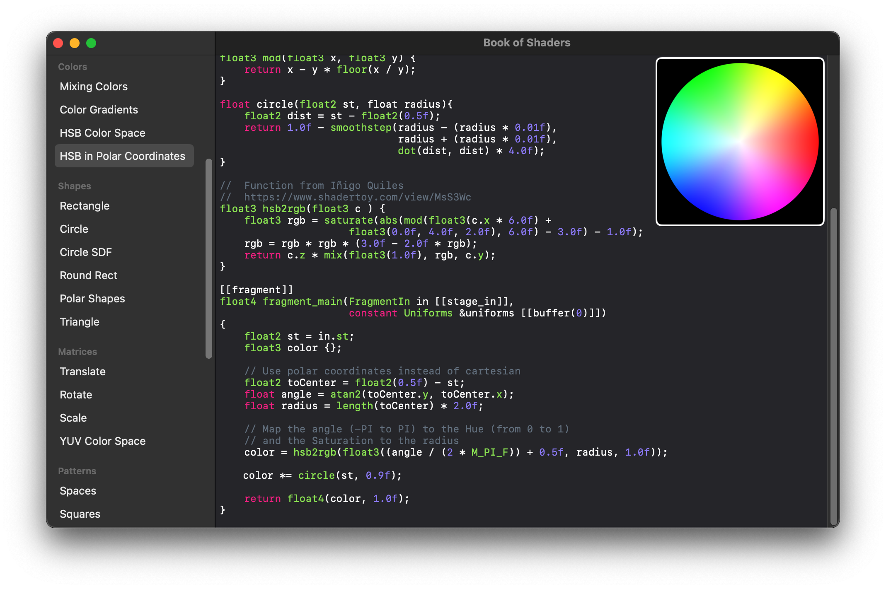

# The Book of Shaders Metal Companion

This project is a live-coding environment for Metal fragment shaders intended to accompany [The Book of Shaders](https://thebookofshaders.com). It includes a rudimentary editor and live Metal viewport that recompiles and renders your shaders as you type.



## Project Status

This project is not intended for serious shader work and should be regarded as a novelty. It contains no facilities for loading or exporting shaders, nor does the UI communicate shader compiler errors, so it is not especially useful for except for the most casual use. Furthermore, because of the copyright status of the original project, most shaders are not included (though they are referenced in the ShaderModels.swift file in case you want to add them yourself).

No further development or support of this project should be expected.

## Metal Shader Porting Tips

Broadly speaking, Metal Shading Language (MSL) is syntactically similar to GLSL, but there are a few differences.

 - GLSL matrix and vector types such as `mat3` and `vec3` should be converted to their respective Metal types (e.g., `float3x3` and `float3`)
 - Metal's `fmod` function differs subtly from GLSL's `mod` function and cannot be used as a direct substitute. Instead, use the following replacement:
 
```c++
float mod(float x, float y) {
    return x - y * floor(x / y);
}
```

 - Be careful when using C++ uniform initialization with Metal's matrix types. To specify a column-major matrix, place each column's elements in its own braces, e.g.:
 
 ```c++
 float2x2 m = { { 1.0f, 0.0f }, { 0.0f, 1.0f } };
 ```
 
  - MSL's `powr` function is a closer match to GLSL's `pow` function than MSL's `pow` function and `powr` should be used whenever the first argument is known to be non-negative.
